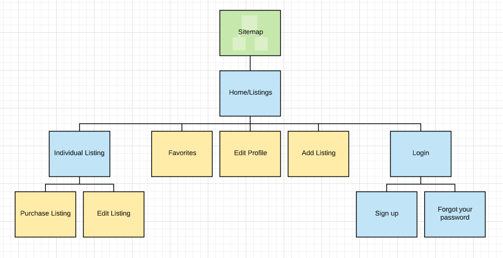
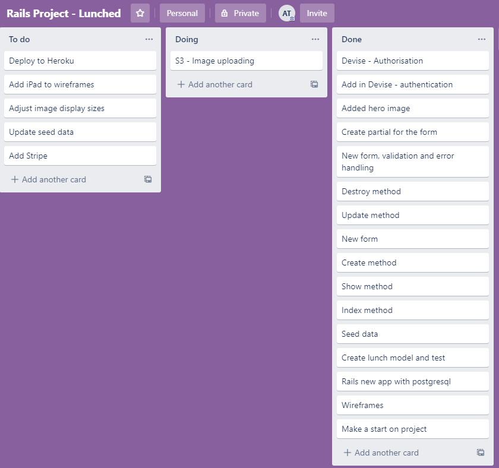
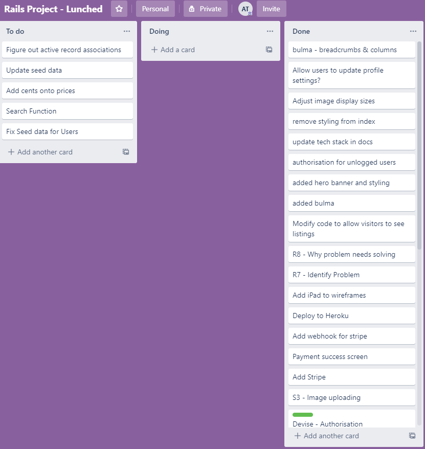
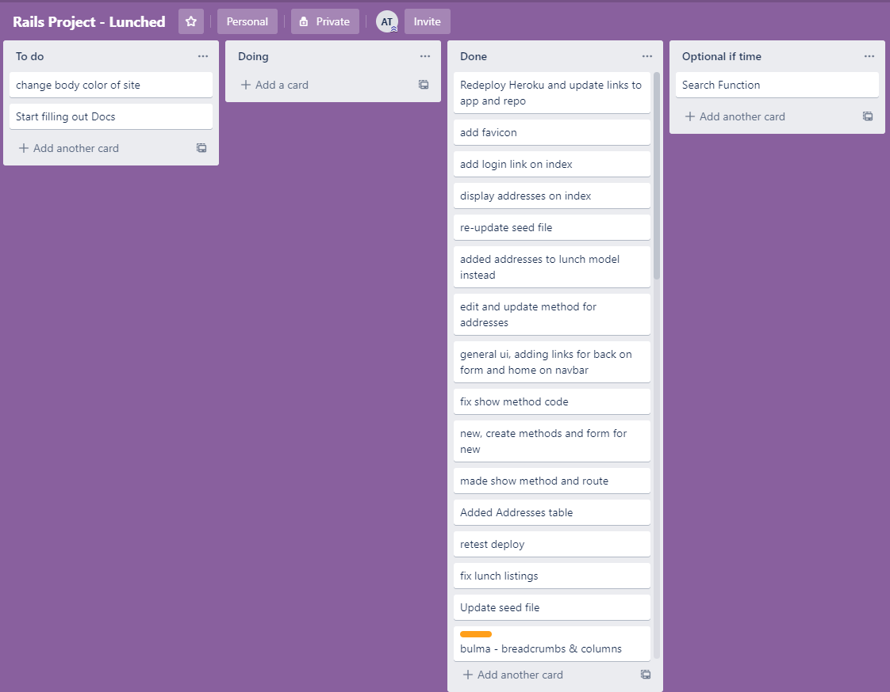
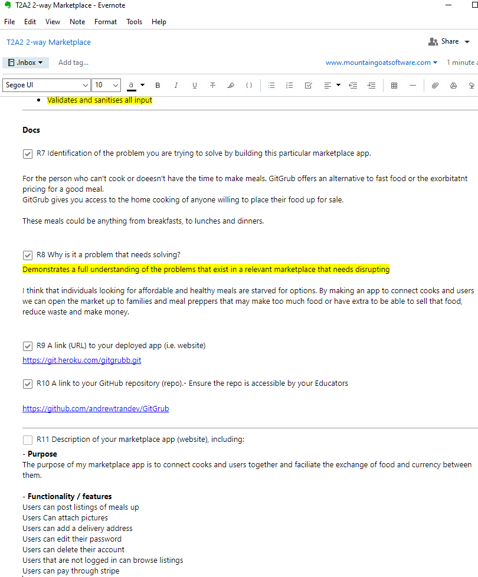

# My 2 way market place template

Link to the deployed app: https://git.heroku.com/gitgrubb.git  <br>
Link to github repo: https://github.com/andrewtrandev/GitGrub

---
## Section 1: Requirement checklist 

Each time you have completed a requirement check it off the list. This way it will be easy for the educators as well as yourselves to track your progress.


- [X] 1. Create your app using Ruby on Rails.
- [X] 2. Use Postgresql database in development and production.
- [X] 3. My app has authentication (eg. Devise).
- [X] 4. My app has authorisation (i.e. users have restrictions on what they can see and edit).
- [X] 5. My app has some type of file (eg. images) uploading capability.
- [X] 6. My app is deployed to Heroku (recommended) or AWS.
- [X] 7. I have identified the problem I am trying to solve by building this particular marketplace app.
- [X] 8. I have explained why is it a problem that needs solving.
- [X] 9. I have provided a link (URL) to my deployed app (i.e. website)
- [ ] 10. I have provided a link to my GitHub repository (repo). I have ensured the repo is accessible by my Educators.
- [ ] 11. I have a complete description of my marketplace app (website), including:  
- [X] 11.1 Purpose  
- [X] 11.2 Functionality / features  
- [X] 11.3 Sitemap  
- [ ] 11.4 Screenshots  
- [X] 11.5 Target audience  
- [X] 11.6 Tech stack (e.g. html, css, deployment platform, etc)  

- [X] 12. I have provided user stories for my app
- [ ] 13. I have provided Wire-Frames for my app 
- [ ] 14. I have provided an ERD for my app
- [ ] 15. I have explained the different high-level components (abstractions) in my app
- [ ] 16. I have listed and described any third party services that your app will use
- [ ] 17. I have described my projects models in terms of the relationships (active record associations) they have with each other.
- [ ] 18. I have discussed the database relations to be implemented in my application
- [ ] 19. I have provided my database schema design
- [X] 20. I have described the way tasks are allocated and tracked in my project

NB Slide/Presentation specific requirements

- [ ] 21. An outline of the problem I solved by building this particular marketplace app, and why it’s a problem that needs solving.
- [ ] 22. A well planned walkthrough of my app
- [ ] 23. I have practiced my presentation at least once and it is 5-6 minutes long. 


---

#### Purpose
The purpose of my marketplace is to connect cooks and users together and facilitate the exchange of food and currency between them.


#### Functionality / features  

- **User accounts** - 
Users can make accounts to access all the features of the website. Users can also edit their password or delete their account.

- **Listings** - 
Users that are not signed in can view the index and click to view listings but are restricted from purchasing meals.
Logged in users can create meal listings and edit them as needed. They can also attach pictures and an address for the listing.

- **Favorites** -
Logged in users can favorite meals by clicking the favorite link displayed when viewing a single meal. All favorites can be viewed from the navigation bar.

- **Secure Payment** -
Payments are handled by stripe, a well-known payment platform that accepts credit cards and google pay. 

<br>

#### Sitemap  
Note the blue boxes/site pages can be accessed by anyone while yellow boxes can only be accessed by signed in users.



#### Screenshots  


#### Target audience  
The main audience are busy individuals and individuals seeking food that offers competitive pricing and healthier alternatives than traditional options.

#### Tech stack (e.g. html, css, deployment platform, etc)  
Application and Data
- Amazon S3
- Bulma
- CSS
- Heroku
- Html
- Javascript
- jQuery
- Postgresql
- Ruby
- Ruby on Rails

  
DevOps
- Git
- Github
- Visual Studio Code

Utilities
- Balsamiq Wireframes
- Devise
- Evernote
- Stripe
- Trello
- Ultrahook


---
### Rubric Criteria

## Section 2: Documentation
---
NB leave the Titles as they are and answer the questions below.

##### 1. Explain the different high-level components (abstractions) in your App.
* Precisely explains and shows understanding of the different high-level components of the app

---

GitGrub was built using Ruby on Rails and utilises the Postgresql database. Ruby on Rails relies on the MVC (Model, View, Controller) framework which divides the app into 3 distinct but connected parts. Rails has very specific naming conventions that it requires so that it can recognise and create links between the MVC framework.

The model, view, controller and database are high-level components of the app that interact to generate the various user interfaces for the client, handle and store data and deal with user requests. Explained below are the different high-level components:

The model, also known as ActiveRecord, primarily deals with persistent data and the manipulation of the database. The model makes use of associations and Object Relational Mapping to manipulate data as objects which allows us to interact with the database without having to write SQL. 
ActiveRecord also automatically generates Create, Read, Update, Delete (CRUD) methods for us to use on our models.

The view, also known as ActionView, is concerned with presentation of data to the user. It mainly uses Embedded Ruby (erb) files to display data. Views can access the instance variables of methods that are appropriately named, this allows Controllers to pass information to views so that they can displayed to end users. Views should have very little logic and mainly have logic to render displays.

The Controller, also known as ActionController, handles requests from users and acts as a middle-man between the view and model by analysing requests and forwarding them to the model to fetch, update or save data and then returning that information to the user through the view. 

Routes are also another important part of the application that help direct incoming http requests to the appropriate controllers and actions.


---
##### 2. List and describe any 3rd party services.
* Includes a complete and detailed description of third party services used in the app
---

#### Devise
Use of Devise gem for user authentication and authorisation. The devise gem automatically generates a User model for us that we can use to assign unique accounts to. It allows us to generate a user and assign an email and password to. It can also generate the necessary views and routes for us to display login, sign up, edit password and forgot password pages.

#### Stripe
The Stripe gem was used to facilitate payments in GitGrub, it allows individuals and businesses to make payments online securely and quickly. 
Stripe has streamlined the process to add payment options to an app and also have security features such an enforced encryption, fraud detection and is Payment Card Industry Data Security Standards compliant (PCI DSS)- a security standard to reduce fraud and data breaches for customers.

#### Amazon S3
Amazon Simple Storage Service, or Amazon S3, provides storage for objects and is mainly used in my application for image uploading and cloud storage of images.


#### Bulma
Bulma is a css framework based on flexbox that I used for quickly applying styling to various components. 

#### Faker
Faker gem was used to generate fake seed data. This was used to test functionality of the models and provide visual feedback of how views would render.

#### Jquery-rails
Jquery-rails was added so that I could have the favorites button work dynamically without re-rendering the whole webpage.

---
##### 3.1. Identify the problem you’re trying to solve by building this particular marketplace App?
* Demonstrates a full understanding of the problems that exist in a relevant marketplace that needs disrupting
---
The problem I'm trying to solve is the lack of options when it comes to meals. Options such as going out to eat at a restaurant during the coronavirus pandemic are not possible, considering most restaurants have shut or drastically reduced their open times and/or seating capacity. 
This leaves the options of cooking your own food or getting food delivered. Delivery options are expensive-for what you get and if it's not expensive than it's usually fast food which isn't particularly healthy.
For the person who can't cook or doesn't have the time to make meals. GitGrub offers an alternative to fast food and the exorbitant pricing for a good meal.
GitGrub gives you access to the home cooking of anyone willing to place their food up for sale. 

These meals could be anything from breakfasts, to lunches and dinners. By opening the market up to anyone who can cook we can allow for a more dynamic food market where naturally food options are diversified, prices are competitive and food of high-quality is popular.

---
##### 3.2 Why is the problem identified a problem that needs solving?
* Demonstrates a full understanding of the problems that exist in a relevant marketplace that needs disrupting
---

This problem needs solving as busy individuals and individuals looking for affordable and healthy meals are starved for options. 
Especially during the coronavirus pandemic, options are limited and now that more people are forced to stay at home, it may be comforting to have alternatives.
By making an app to connect cooks and users we can open the market up to cooks,families and meal preppers that can take advantage of a unique time where most people are eating at home.

The open market also allows for more competitive prices and higher-quality food which will naturally sell more than lesser-quality food, this creates an incentive to maintain quality and innovate on better dishes.

---
##### 4. Describe your project’s models in terms of the relationships (active record associations) they have with each other.
* Complete discussion of the project’s models with an understanding of how its active record associations function
---
<!-- Active record associations allow active record models to be associated with each other and interact with each other in an abstracted way.

Dependent controls what happens to the object when the parent is destroyed. 
Dependent Destroy causes the associated object to be destroyed.  -->

```ruby
class User < ApplicationRecord
  has_many :favorites, dependent: :destroy
  has_many :lunches, dependent: :destroy
end
```
A User can have many lunches and many favorites. When a user is destroyed it will also consequently delete the favorites and lunches that reference the user as a foreign key.

```ruby
class Lunch < ApplicationRecord
    belongs_to :user
end
```

The Lunch model is used to store the associated data for a meal. It belongs to a User which means each Lunch item can only be associated and created by a single user, i.e A lunch item can not have many users associated with it.


```ruby
class Favorite < ApplicationRecord
  belongs_to :user
  belongs_to :lunch
end
```

The Favorites model is used to attach a favorite to a specific lunch and  user. A Favorite belongs to a User and Lunch. The combination of both of these act as a join table to define Favorites.
If a favorite only belonged to a user then there would be no reference to what lunch it would refer to and if a favorite only belonged to a lunch then it wouldn't be belong to any user. Hence why we need both values.

---
##### 5. Discuss the database relations to be implemented.
---

* Provides coherent discussion of the database relations, with reference to the ERD

numbers and screenshots


---
##### 6. Provide your database schema design.
* Flawless, complex, complete, and well thought through ERDs provided
---


---
##### 7. Provide User stories for your App.

* You also just use normal markdown to describe them
* User stories are well thought out, relevant, and comprehensively cover the needs of the app
---

A user can be either a buyer or seller.

- As a user, I want to view meals without logging in.
- As a user, I want to be able to logout at any screen.
- As a user, I want to be able to buy meals.
- As a user, I want to be able to favorite meals that I like and view them later.
- As a seller, I can create listings and attach details to my listings including images.
- As a user, I want payment to be handled quickly and securely.
- As a seller, only I should be able to edit and delete my own listings.
- As a user, I want to be able to navigate the various sections of the website quickly.


##### 8. Provide Wireframes for your App.
  
  
  
  
  

* More than five detailed and well designed wireframes provided, for several different screen sizes (as required for the app)

##### 9. Describe the way tasks are planned and tracked in your project.


Tasks will be tracked and planned through the use of Trello, Evernote and the assignment criteria. I've written up the assignment criteria and allocated checkboxes in Evernote, this will help me identify what has and has not been completed. Daily tracking of tasks can be broken down and placed in Trello.

I've broken my two weeks down to roughly 4 stages.

The aim of the first stage was to get a minimum viable product(mvp) up and running. It involved generating wireframes and the mvp, consisting of getting the CRUD functionality working and systematically completing the code requirements.

The aim of the second stage was get the app deploy ready. This involved having completely finished the code requirements and testing if the app would deploy. 
Optional features such as stripe and styling were added in after deployment was successful.

At the third stage I wanted to get most of the app done and start working on documentation. This stage included more styling and modifying of one of the models.   


<br>

11.5.20 / Day 4 - Below image is the state of my trello board


14.5.20 / Day 7


17.5.20 / Day 10



Below is an example of me using evernote to checkbox off tasks and quickly scaffold out drafts for them.


* Shows significant planning for how tasks are planned and tracked, including a full description of the process and of the tools used


##### 10. ERD provided represents a normalised database model.

* Meets D with no duplication and ideal definition of entities.


---
## Section 3: Code specific assessment. 

This section can be deleted from the readme. I have only included it here to draw your attention to it. 

##### 11. Model implementation represents a normalised database model.
* Meets D with no duplication and ideal model implementation.

##### 12. Model implementation represents a normalised database model.
* Meets D and represents a highly optimised solution.

##### 13. Implemented controllers demonstrate correct use of commands to query the database infrastructure.
* Meets D and does so elegantly (queries chosen are the most elegant to achieve the result).

##### 14. Queries implemented provide correct data for the given scenario.
* Meets CR and demonstrates exceptional understanding of database queries.

##### 15. Code comments demonstrate how the queries implemented correctly represent the database structure.
* Meets D and all comments are exceptionally written.

##### 16. Identify and use appropriate model methods.
* Identifies and uses appropriate model methods for querying on self and its relationships, extends models scope where appropriate

##### 17. Minimising database calls needed to perform an action.
* Minimise all database calls and implement eager loading where appropriate

##### 18. Sanitise and validates input to maintain data integrity.
* Validates and sanitises all input


